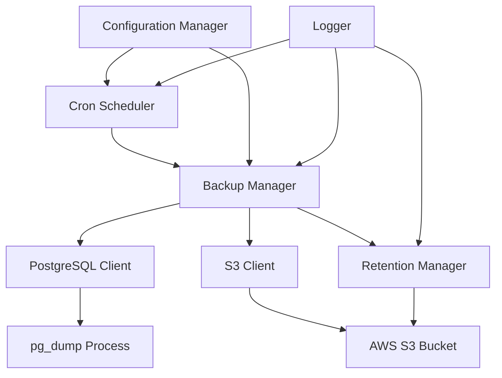

# Design Document

## Overview

The PostgreSQL S3 Backup application is a containerized service that automatically creates compressed database backups and uploads them to Amazon S3 on a configurable schedule. The application uses `pg_dump` for database backups, AWS SDK for S3 operations, and a cron scheduler for automation. It's designed to run as a standalone Docker container with minimal resource requirements.

## Architecture

The application follows a simple, single-process architecture with the following key components:



### Core Components:
- **Configuration Manager**: Validates and manages environment variables
- **Cron Scheduler**: Handles scheduled backup execution using cron expressions
- **Backup Manager**: Orchestrates the backup process
- **PostgreSQL Client**: Manages database connections and backup operations
- **S3 Client**: Handles file uploads and bucket operations
- **Retention Manager**: Manages backup lifecycle and cleanup
- **Logger**: Provides structured logging throughout the application

## Components and Interfaces

### Configuration Manager
```typescript
interface BackupConfig {
  s3Url?: string;
  s3Bucket: string;
  s3Path: string;
  s3AccessKey: string;
  s3SecretKey: string;
  postgresConnectionString: string;
  backupInterval: string; // cron format
  retentionDays?: number;
}
```

### Backup Manager
```typescript
interface BackupManager {
  executeBackup(): Promise<BackupResult>;
  validateConfiguration(): boolean;
}

interface BackupResult {
  success: boolean;
  fileName: string;
  fileSize: number;
  s3Location: string;
  duration: number;
  error?: string;
}
```

### S3 Client
```typescript
interface S3Client {
  uploadFile(filePath: string, key: string): Promise<string>;
  listObjects(prefix: string): Promise<S3Object[]>;
  deleteObject(key: string): Promise<void>;
}

interface S3Object {
  key: string;
  lastModified: Date;
  size: number;
}
```

### PostgreSQL Client
```typescript
interface PostgreSQLClient {
  testConnection(): Promise<boolean>;
  createBackup(outputPath: string): Promise<BackupInfo>;
}

interface BackupInfo {
  filePath: string;
  fileSize: number;
  databaseName: string;
  timestamp: Date;
}
```

## Data Models

### Backup Metadata
```typescript
interface BackupMetadata {
  fileName: string;
  timestamp: Date;
  databaseName: string;
  fileSize: number;
  s3Key: string;
  compressionRatio: number;
}
```

### Configuration Schema
```typescript
interface EnvironmentConfig {
  // Required
  S3_BUCKET: string;
  S3_ACCESS_KEY: string;
  S3_SECRET_KEY: string;
  POSTGRES_CONNECTION_STRING: string;
  BACKUP_INTERVAL: string;
  
  // Optional
  S3_URL?: string;
  S3_PATH?: string;
  BACKUP_RETENTION_DAYS?: string;
  LOG_LEVEL?: string;
}
```

## Implementation Details

### Technology Stack
- **Runtime**: Node.js 22+ (Alpine Linux base image)
- **Language**: TypeScript for type safety and better maintainability
- **PostgreSQL Client**: `pg_dump` command-line tool
- **S3 SDK**: AWS SDK v3 for JavaScript
- **Scheduler**: `node-cron` for cron-based scheduling
- **Compression**: Built-in gzip compression
- **Logging**: Winston for structured logging

### File Naming Convention
Backup files will follow this naming pattern:
```
{S3_PATH}/postgres-backup-{YYYY-MM-DD_HH-MM-SS}.sql.gz
```

### Backup Process Flow
1. **Validation**: Check all required environment variables
2. **Connection Test**: Verify PostgreSQL and S3 connectivity
3. **Backup Creation**: Execute `pg_dump` with compression
4. **Upload**: Stream compressed backup to S3
5. **Cleanup**: Remove local temporary files
6. **Retention**: Delete expired backups if retention is configured
7. **Logging**: Record operation results

### Cron Scheduling
The application will use `node-cron` to parse and execute cron expressions:
- Supports standard cron format (minute, hour, day, month, day-of-week)
- Validates cron expressions on startup
- Handles timezone considerations (UTC default)

## Error Handling

### Error Categories and Responses

1. **Configuration Errors**
   - Missing required environment variables → Exit with error code 1
   - Invalid cron expression → Exit with error code 2
   - Invalid S3 configuration → Exit with error code 3

2. **Runtime Errors**
   - PostgreSQL connection failure → Log error, retry next scheduled time
   - Backup creation failure → Log error, cleanup temp files
   - S3 upload failure → Log error, retry with exponential backoff
   - Retention cleanup failure → Log warning, continue operations

3. **Recovery Strategies**
   - **Transient Failures**: Implement exponential backoff for S3 operations
   - **Connection Issues**: Retry database connections with timeout
   - **Disk Space**: Monitor and cleanup temporary files aggressively
   - **Partial Uploads**: Implement multipart upload resumption

### Logging Strategy
- **Startup**: Log configuration (sanitized), validation results
- **Scheduled Runs**: Log each cron trigger and execution start
- **Operations**: Log backup start, progress, completion with metrics
- **Errors**: Log full error details with context and stack traces
- **Retention**: Log cleanup operations and deleted file counts

## Testing Strategy

### Unit Testing
- **Configuration Manager**: Test environment variable validation
- **Backup Manager**: Mock PostgreSQL and S3 operations
- **S3 Client**: Test upload, list, and delete operations with mocked AWS SDK
- **Retention Manager**: Test date calculations and cleanup logic
- **Cron Parser**: Test various cron expression formats

### Integration Testing
- **End-to-End Backup**: Test complete backup flow with test database
- **S3 Operations**: Test against localstack or MinIO for S3 compatibility
- **Error Scenarios**: Test network failures, invalid credentials, disk space issues
- **Retention Logic**: Test backup cleanup with various retention periods

### Docker Testing
- **Container Build**: Verify all dependencies are included
- **Environment Variables**: Test configuration through Docker environment
- **Volume Mounts**: Test temporary file handling and cleanup
- **Resource Limits**: Test behavior under memory and CPU constraints

### Performance Testing
- **Large Database Backups**: Test with databases of various sizes
- **Concurrent Operations**: Ensure single backup execution (no overlaps)
- **Memory Usage**: Monitor memory consumption during backup operations
- **Network Efficiency**: Test S3 upload performance and resumption

## Security Considerations

### Credential Management
- Environment variables for sensitive data (never logged)
- Support for Docker secrets mounting
- Validation of S3 permissions on startup

### Network Security
- Support for custom S3 endpoints (private clouds)
- TLS encryption for all S3 communications
- PostgreSQL connection security (SSL support)

### Container Security
- Non-root user execution
- Minimal base image (Alpine Linux)
- No unnecessary packages or tools
- Read-only filesystem where possible

## Deployment Configuration

### Docker Image Structure
```dockerfile
FROM node:22-alpine
RUN apk add --no-cache postgresql-client
WORKDIR /app
COPY package*.json ./
RUN npm ci --only=production
COPY dist/ ./dist/
USER node
CMD ["node", "dist/index.js"]
```

### Docker Compose Template
```yaml
version: '3.8'
services:
  postgres-backup:
    build: .
    environment:
      - S3_BUCKET=my-backup-bucket
      - S3_ACCESS_KEY=${S3_ACCESS_KEY}
      - S3_SECRET_KEY=${S3_SECRET_KEY}
      - POSTGRES_CONNECTION_STRING=${POSTGRES_URL}
      - BACKUP_INTERVAL=0 2 * * *  # Daily at 2 AM
      - BACKUP_RETENTION_DAYS=30
    restart: unless-stopped
```